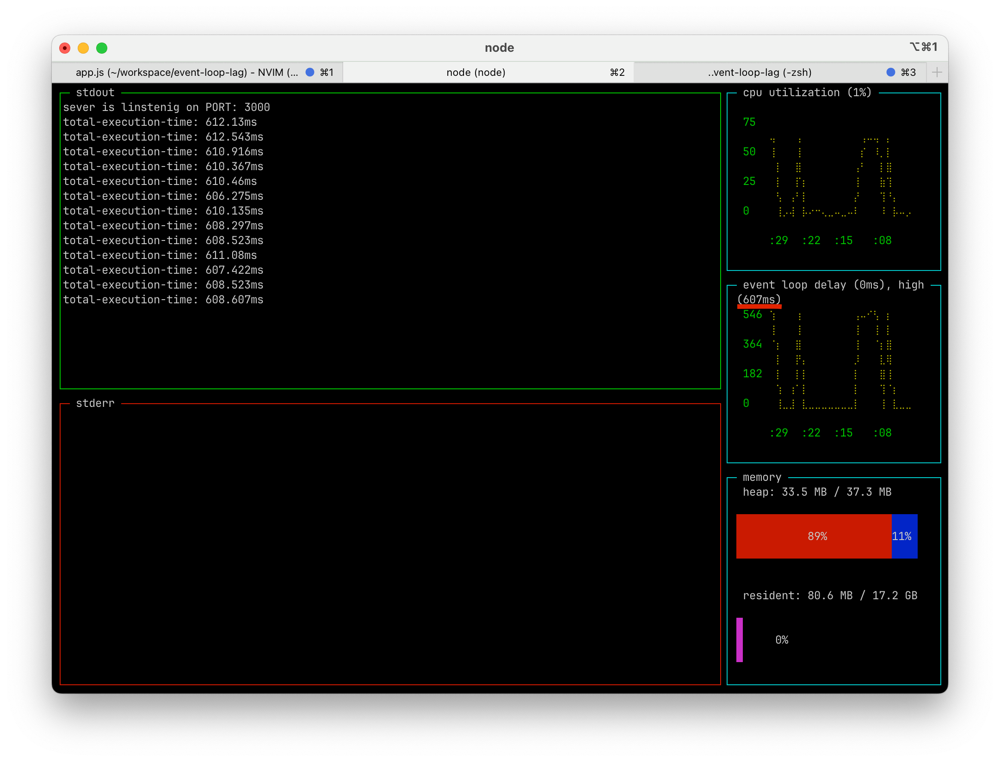

# Event Loop Lag

Задержка между запланированным временем выполнения обратного вызова и
фактическим временем выполнения.

Event Loop выполняется в основном потоке и если его заблокировать, то такие
стадии EL как таймеры не будут отрабатывать/будет значительная задержка.

В среднем задержка 100мс - повод задуматься, 300мс - это уже проблемы. Но,
конечно, все зависит от контекста.

Для измерения лага можно пользоваться инструментами New Relic, Appdynamics,
Dynatrace, [Nodejs-dashboard](https://www.npmjs.com/package/nodejs-dashboard)(open-source).

Многие исследования показывают, что плохая отзывчивость ресурса негативно
влияет на бизнес.

## Примеры

### 1

```sh
node 01.js
```

Таймаут не может отработать - весь Main thread занят выполнением.

```js
while (!stop) {
  console.log("I am blocking event loop");
}
```

### 2

```sh
node 02.js
```

Таймаут не может отработать - весь Main thread занят расчетом простых чисел.

### 3

```sh
yarn dev
```

Сервер долго не может ответить на эндпоинте `GET /test`, Main thread
заблокирован расчетом простых чисел.


